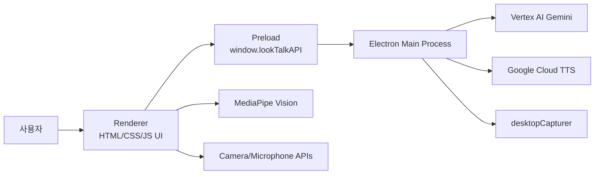

# LookTalk AI 프로젝트 명세서

## 1. 프로젝트 개요

LookTalk AI는 Electron 기반의 데스크톱 AI 비서 애플리케이션이다. 화면 위에 항상 표시되는 작은 로봇 캐릭터 위젯을 통해 사용자는 텍스트, 음성, 화면 캡처, 파일 첨부를 입력으로 전달할 수 있으며, 앱은 Google Vertex AI Gemini 모델을 호출해 한국어 응답을 제공한다.

이 프로젝트의 핵심 목표는 사용자가 별도 채팅창을 크게 열지 않아도 데스크톱 위에서 가볍게 AI에게 질문하고, 현재 화면이나 첨부 파일을 함께 맥락으로 전달할 수 있는 개인용 보조 인터페이스를 제공하는 것이다.

## 2. 개발 환경

| 항목 | 내용 |
| --- | --- |
| 런타임 | Node.js, Electron |
| 앱 유형 | 데스크톱 위젯 애플리케이션 |
| 메인 엔트리 | `src/main/main.js` |
| 렌더러 엔트리 | `src/renderer/index.html`, `src/renderer/js/app.js` |
| 패키지 매니저 | npm |
| 실행 명령 | `npm start` |
| 주요 외부 서비스 | Google Vertex AI Gemini, Google Cloud Text-to-Speech |
| 주요 브라우저 API | MediaDevices, MediaRecorder, FileReader, Web Audio API |
| 비전 인식 | MediaPipe Tasks Vision CDN |

## 3. 주요 기능

### 3.1 항상 위에 표시되는 로봇 위젯

- Electron `BrowserWindow`를 투명하고 프레임 없는 창으로 생성한다.
- 창은 항상 위에 표시되며 작업 표시줄에서 제외된다.
- 사용자는 캐릭터 영역을 드래그하여 위젯 위치를 이동할 수 있다.
- 마지막 창 위치와 크기는 Electron `userData` 경로의 `window-bounds.json`에 저장된다.
- 로봇 캐릭터는 idle, listening, thinking, happy, error, sleeping 상태를 가진다.

### 3.2 텍스트 기반 AI 질문

- 사용자는 입력 버튼을 눌러 텍스트 입력창을 열 수 있다.
- Enter 또는 전송 버튼으로 질문을 제출한다.
- 렌더러 프로세스는 `window.lookTalkAPI.processAiRequest()`를 통해 메인 프로세스에 요청한다.
- 메인 프로세스는 요청 payload를 Vertex AI `generateContent` 형식으로 변환해 Gemini 모델에 전달한다.

### 3.3 음성 질문

- 음성 트리거가 켜져 있을 때 카메라 기반 손 들기 인식이 동작한다.
- 손 들기가 감지되면 마이크 녹음이 시작된다.
- `MediaRecorder`가 `audio/webm;codecs=opus` 형식으로 음성을 수집한다.
- Web Audio API로 실시간 볼륨을 분석하고, 일정 시간 조용하면 자동으로 녹음을 종료한다.
- STT를 별도로 수행하지 않고 녹음된 오디오 자체를 Gemini 입력 파트로 전달한다.

### 3.4 손 들기 기반 트리거

- `FaceTracker`는 MediaPipe FaceLandmarker와 HandLandmarker를 사용한다.
- 카메라 영상에서 얼굴과 손 랜드마크를 감지한다.
- 손목보다 검지와 중지가 위에 있고, 손끝이 이마보다 일정 수준 위에 있으며, 손가락이 충분히 펴져 있으면 손 들기로 판단한다.
- 손 들기가 감지되면 음성 녹음 플로우가 시작된다.

### 3.5 화면 맥락 포함

- 사용자는 화면 포함 버튼을 활성화할 수 있다.
- 질문 전송 시 Electron `desktopCapturer`가 현재 마우스가 위치한 디스플레이 화면을 캡처한다.
- 캡처 이미지는 PNG Base64로 변환되어 Gemini 멀티모달 입력에 포함된다.
- 화면 캡처 실패 시 텍스트 또는 다른 입력만으로 요청을 계속 처리한다.

### 3.6 파일 첨부

지원 파일 유형은 다음과 같다.

| 유형 | 처리 방식 |
| --- | --- |
| 이미지 | MIME 타입과 Base64 이미지 데이터를 Gemini 입력에 포함 |
| PDF | `application/pdf` inline data로 Gemini 입력에 포함 |
| 텍스트 파일 | 파일명을 포함한 텍스트 프롬프트로 변환 |

지원 텍스트 확장자는 `txt`, `md`, `json`, `csv`, `tsv`, `js`, `ts`, `html`, `css`, `xml`, `log`이다. 텍스트 파일은 최대 20,000자까지만 포함한다.

### 3.7 응답 표시 및 TTS

- AI 응답은 말풍선에 타이핑 애니메이션으로 표시된다.
- 설정값에 따라 말풍선 유지 시간이 달라진다.
- TTS 설정이 켜져 있으면 응답 텍스트를 Google Cloud Text-to-Speech에 전달한다.
- TTS 결과는 Base64 오디오로 반환되며 렌더러에서 `Audio` 객체로 재생한다.
- 성격 설정에 따라 TTS 스타일 프롬프트가 달라진다.

### 3.8 대화 기록

- `HistoryManager`가 사용자와 AI 메시지를 관리한다.
- 기록 저장 옵션이 켜져 있으면 최근 30개 메시지를 `localStorage`에 저장한다.
- Gemini 요청에는 최근 대화 맥락 최대 10개가 포함된다.
- 대화 기록 서랍에서 이번 대화 내용을 확인하고 지울 수 있다.

### 3.9 사용자 설정

사용자 설정은 `localStorage`에 저장된다.

| 설정 | 기본값 | 설명 |
| --- | --- | --- |
| 컬러 팔레트 | `mint` | 로봇 캐릭터 색상 |
| 성격 | `calm` | AI 답변 및 TTS 톤 |
| 답변 길이 | `short` | Gemini 최대 출력 토큰과 길이 지시 |
| 말풍선 시간 | `5000` | 응답 말풍선 표시 시간 |
| 음성 트리거 | `true` | 손 들기 기반 음성 입력 사용 여부 |
| 기록 저장 | `true` | 대화 기록 localStorage 저장 여부 |
| TTS | `true` | AI 응답 음성 재생 여부 |

## 4. 시스템 구성

### 4.1 프로세스 구조



### 4.2 주요 디렉터리

| 경로 | 역할 |
| --- | --- |
| `src/main/main.js` | Electron 앱 생성, IPC 핸들러, 화면 캡처, 창 제어 |
| `src/main/geminiService.js` | Google 인증, Gemini 응답 생성, TTS 요청 |
| `src/main/preload.js` | 렌더러에 안전한 IPC API 노출 |
| `src/renderer/index.html` | 위젯 UI 마크업 |
| `src/renderer/css/main.css` | 로봇 위젯, 패널, 말풍선 스타일 |
| `src/renderer/js/app.js` | 렌더러 앱 흐름, 이벤트 연결, AI 요청 조립 |
| `src/renderer/js/faceTracker.js` | MediaPipe 얼굴/손 인식 |
| `src/renderer/js/speechHandler.js` | 마이크 녹음과 음성 종료 감지 |
| `src/renderer/js/historyManager.js` | 대화 기록 저장 및 렌더링 |
| `src/renderer/js/themeManager.js` | 테마와 사용자 설정 관리 |
| `src/renderer/js/uiController.js` | 로봇 상태, 말풍선, 눈동자, 볼륨 반응 제어 |
| `src/renderer/js/ttsService.js` | TTS 오디오 재생 |
| `src/renderer/js/aiClient.js` | 렌더러에서 메인 프로세스로 AI 요청 전달 |
| `src/renderer/js/constants.js` | 로봇 상태 상수 |

## 5. AI 요청 흐름

1. 사용자가 텍스트, 음성, 파일, 화면 맥락 중 하나 이상을 입력한다.
2. `app.js`의 `requestAiResponse()`가 입력값과 설정값을 하나의 payload로 조립한다.
3. `AiClient.request()`가 preload API를 통해 `process-ai-request` IPC를 호출한다.
4. `main.js`가 payload를 Gemini 멀티모달 `parts` 배열로 변환한다.
5. `geminiService.js`가 최근 대화 맥락과 현재 입력을 Vertex AI 요청 본문으로 구성한다.
6. Vertex AI 응답 텍스트를 추출해 렌더러로 반환한다.
7. 렌더러가 말풍선과 대화 기록을 갱신하고, TTS가 켜져 있으면 음성 재생을 시작한다.

## 6. 외부 서비스 및 환경 변수

앱은 Google Application Default Credentials를 사용한다. 기본 인증 파일 경로는 `~/.config/gcloud/application_default_credentials.json`이며, `GOOGLE_APPLICATION_CREDENTIALS` 환경 변수로 별도 경로를 지정할 수 있다.

| 환경 변수 | 필수 여부 | 기본값 | 설명 |
| --- | --- | --- | --- |
| `GOOGLE_CLOUD_PROJECT` 또는 `GCLOUD_PROJECT` | 필수 | 없음 | Vertex AI 프로젝트 ID |
| `GOOGLE_APPLICATION_CREDENTIALS` | 선택 | gcloud 기본 ADC 경로 | Google 인증 JSON 경로 |
| `GOOGLE_CLOUD_QUOTA_PROJECT` | 선택 | ADC의 `quota_project_id` | 과금/쿼터 프로젝트 |
| `VERTEX_AI_LOCATION` | 선택 | `global` | Gemini 호출 위치 |
| `GEMINI_MODEL` | 선택 | `gemini-3.1-flash-lite-preview` | 응답 생성 모델 |
| `GEMINI_TTS_MODEL` | 선택 | `gemini-3.1-flash-tts-preview` | TTS 모델 |
| `GEMINI_TTS_LOCATION` | 선택 | `global` | TTS 호출 위치 |
| `GEMINI_TTS_LANGUAGE_CODE` | 선택 | `ko-KR` | TTS 언어 |
| `GEMINI_TTS_VOICE` | 선택 | `Kore` | TTS 음성 |
| `GEMINI_TTS_AUDIO_ENCODING` | 선택 | `MP3` | TTS 오디오 포맷 |

## 7. 보안 및 권한

- 렌더러 프로세스에서 `nodeIntegration`은 비활성화되어 있다.
- `contextIsolation`을 활성화하고 preload를 통해 필요한 API만 노출한다.
- 화면 캡처는 메인 프로세스의 IPC 핸들러를 통해 수행한다.
- 카메라, 마이크, 화면 기록 권한은 OS와 브라우저 런타임 권한에 의존한다.
- `.env`는 로컬 실행 설정을 위한 파일이며 저장소에 민감 정보가 포함되지 않도록 관리해야 한다.
- 대화 기록은 사용자의 로컬 브라우저 저장소에 저장된다.

## 8. 비기능 요구사항

### 8.1 사용성

- 위젯은 항상 화면 위에 있어야 한다.
- 기본 상호작용은 캐릭터 클릭, 버튼 클릭, 손 들기 트리거로 단순하게 유지한다.
- AI 응답 상태는 캐릭터 애니메이션과 말풍선으로 직관적으로 표현한다.

### 8.2 안정성

- AI 요청 중 중복 요청을 방지한다.
- 화면 캡처 실패 시 전체 요청이 실패하지 않도록 한다.
- 파일 형식이 지원되지 않으면 사용자에게 안내하고 요청을 보내지 않는다.
- TTS 실패는 응답 표시 자체를 막지 않는다.

### 8.3 성능

- 음성 트리거가 꺼져 있으면 카메라 스트림을 중지한다.
- MediaPipe 모델은 초기화 후 매 프레임 영상 분석에 사용된다.
- Electron 백그라운드 타이머 제한을 비활성화해 항상 위 위젯의 반응성을 유지한다.

## 9. 현재 제한사항

- 패키지 의존성에는 Electron만 명시되어 있으며, MediaPipe는 CDN에서 직접 로드한다.
- 별도의 테스트 스크립트가 정의되어 있지 않다.
- 음성 입력은 STT 텍스트 변환 없이 오디오 자체를 Gemini에 전달한다.
- 화면 캡처는 현재 마우스가 위치한 디스플레이 기준으로 수행된다.
- 텍스트 입력 길이는 HTML 기준 120자로 제한되어 있다.
- 텍스트 파일 첨부는 20,000자까지만 Gemini 입력에 포함한다.
- 네트워크가 없거나 Google 인증이 설정되지 않으면 AI/TTS 기능을 사용할 수 없다.

## 10. 실행 방법

1. Node.js와 npm을 설치한다.
2. 프로젝트 루트에서 의존성을 설치한다.

```bash
npm install
```

3. Google Cloud ADC 인증을 설정한다.

```bash
gcloud auth application-default login
```

4. `.env`에 Google Cloud 프로젝트와 필요한 모델 설정을 입력한다.

```env
GOOGLE_CLOUD_PROJECT=your-project-id
VERTEX_AI_LOCATION=global
GEMINI_MODEL=gemini-3.1-flash-lite-preview
GEMINI_TTS_MODEL=gemini-3.1-flash-tts-preview
```

5. 앱을 실행한다.

```bash
npm start
```

## 11. 향후 개선 후보

- 테스트 스크립트와 기본 단위 테스트 추가
- Google 인증 상태 점검 UI 추가
- AI 요청 실패 원인별 사용자 메시지 세분화
- 첨부 파일 크기 제한과 사용자 안내 강화
- 대화 기록 내보내기 기능 추가
- 화면 캡처 권한 실패 시 OS별 안내 제공
- 음성 트리거 민감도 설정 UI 추가
